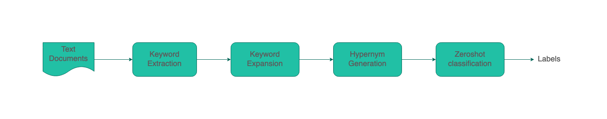

zeroshot_topics
===============

.. image:: https://static.pepy.tech/personalized-badge/zeroshot_topics?period=total&units=international_system&left_color=black&right_color=orange&left_text=Downloads

.. contents:: **Table of Contents**
    :backlinks: none

Introduction
------------

Hand-labelled training sets are expensive and time consuming to create usually. 
Some datasets call for domain expertise (eg: medical/finance datasets etc). 
Given these factors around costs and inflexibility of hand-labelling it would be nice 
if there are tools which can help us get started quickly with minimal labelled dataset - enter weak supervision. 

**But what if you do not have any labelled data at all? is there a way to still label your data automatically in some way?**
That's where **zeroshot_topics** might be useful! to help you to be up and running quickly. 

*zeroshot_topics* let's you do exactly that! it leverages the power of zeroshot-classifiers, transformers & knowledge graphs to automatically suggest labels/topics from your text data. all you need to do is point it towards your data. 

Algorithm
---------

The algorithm contains, 4 stages: 

1. **Keyword & Keyphrase extraction**: This is done with the help of `KeyBERT <https://github.com/MaartenGr/KeyBERT>`_. but really any sort of keyword extractor can be used.
2. **Keyword/Keyphrase expansion via knowledge graphs/Taxanomy**: Then we expand the important keywords we discovered by using some sort of taxanomy/knowledge graph like wordnet, conceptnet etc. 
3. **Trace the Hypernyms for the keywords**: Identify the Hypernyms(the root/parent word) and use this as the psuedo-label for the zeroshot classifier. 
4. **Zeroshot classification**: Use the Hypernyms and documents to label via zeroshot classifiers. 

Note: Currently, this tends to work well on short-texts in general, in the future I intend to experiment and see how we can support long texts as well. 

Installation
------------

zeroshot_topics is distributed on `PyPI <https://pypi.org>`_ as a universal
wheel and is available on Linux/macOS and Windows and supports
Python 3.7+ and PyPy.

.. code-block:: bash

    $ pip install zeroshot_topics

Usage
------

.. code-block:: python 

    from zeroshot_topics import ZeroShotTopicFinder

    zsmodel = ZeroShotTopicFinder()
    
    text = """can you tell me anything else okay great tell me everything you know about George_Washington. 
    he was the first president he was well he I'm trying to well he fought in the Civil_War he was a general 
    in the Civil_War and chopped down his father's cherry tree when he was a little boy he that's it."""
    
    zsmodel.find_topic(text, n_topic=2)

    # Output - Topics: ['War', 'Head Of State']
    

Roadmap
-------

Some things that i plan to add in the coming days, if there's some interest in this work by the community. 

- Support custom keyword extractors.
- Support Custom Knowledge-graphs & taxonomy.
- Support Custom Zeroshot-classifiers in the pipeline.
- Add Usecase examples & improve documentation.
- Optimise the overall library and make it a faster.
- Support Long Text documents.

License
-------

zeroshot_topics is distributed under the terms of

- `MIT License <https://choosealicense.com/licenses/mit>`_
- `Apache License, Version 2.0 <https://choosealicense.com/licenses/apache-2.0>`_
